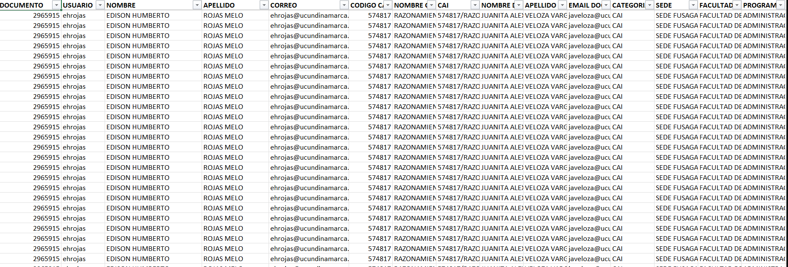
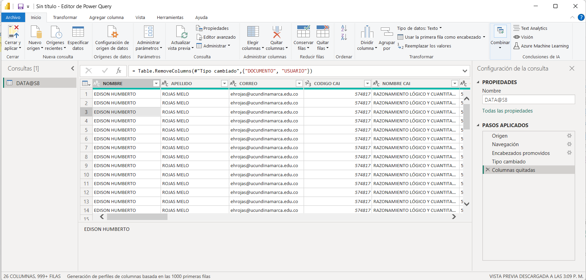
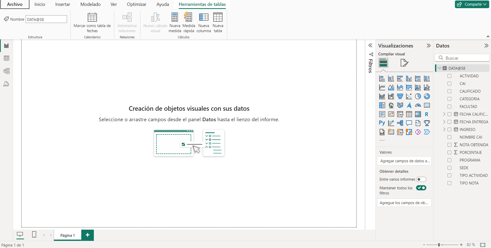
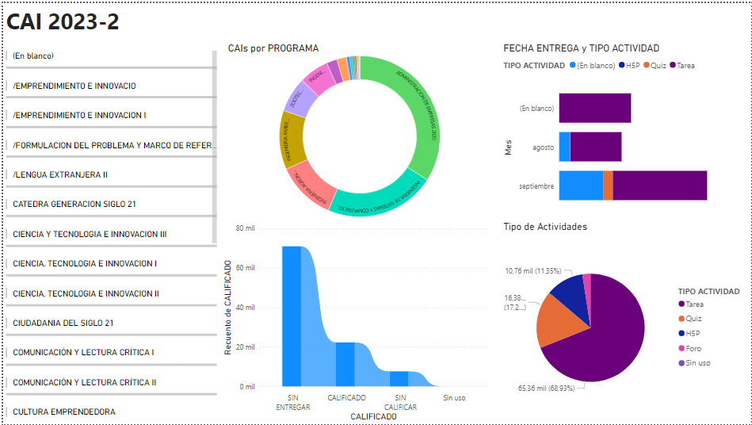
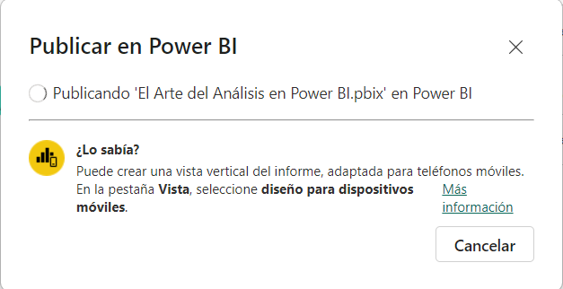
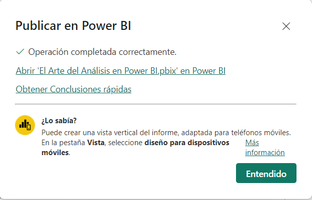
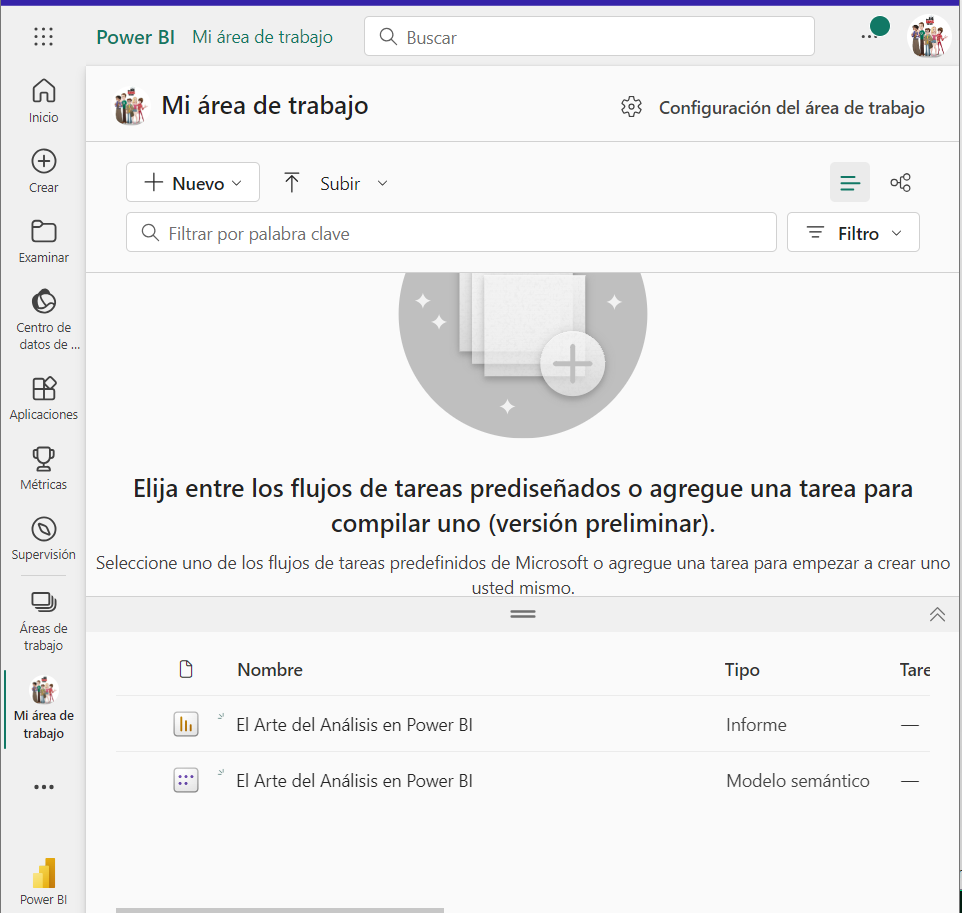

# Ciencia de Datos Fácil: El Arte del Análisis en Power BI

**Andrés David Ojeda López
Laura Valentina Martinez Espinosa**

***

### Introduccion y Objetivos del Taller

Presentación de Andrés Ojeda y Valentina Martinez, se le da bienvenia a los participantes.

**¿Que es Power BI?**

Power BI es un ecosistema de productos de inteligencia empresarial (BI) desarrollado por Microsoft que permite a los usuarios analizar y visualizar datos para obtener información significativa y tomar decisiones más informadas. 

**Importancia del analisis de datos**
El análisis de datos es crucial en el siglo XXI debido a la creciente cantidad de información que se genera y recopila diariamente. Las organizaciones y las personas necesitan poder comprender esta información para tomar decisiones informadas y obtener una ventaja competitiva. Power BI es una herramienta que democratiza este proceso, volviéndolo accesible a una variedad de usuarios, desde científicos de datos hasta analistas ciudadanos.

### Importación y transformación de datos
Se trabajará en base a la data generada por el CMA correspondientes a un CAI del año 2023 de la universidad de Cundinamarca.

Teniendo en cuenta que en la tabla existen estas columnas: 
- Documento
- Usuario 
- Nombre
- Apellido
- Correo
- Código CAI
- Nombre CAI
- CAI
- Nombre Docente
- Apellido Docente
- Email Docente 
- Categoria
- Sede
- Facultad
- Programa
- Ingreso
- Tipo de Nota
- Actividad
- Tipo de Actividad 
- Nota Obtenida
- Nota Maxima
- Fecha Entrega
- Fecha Calificación
- Porcentaje 
- Calificado 

Al analizar la información disponible, es importante considerar que algunos datos son sensibles y requieren un tratamiento adecuado para proteger la privacidad o la seguridad. Además, es fundamental identificar los datos repetitivos o redundantes que pueden ser omitidos sin afectar la calidad ni la relevancia de la información más importante. Al eliminar estos datos redundantes y centrar el análisis en los datos esenciales, se garantiza que la información obtenida sea precisa, eficiente y significativa.

**Datos que pueden ser Analizados:**
- Nombre CAI
- Sede 
- Facultad
- Programa
- Ingreso
- Tipo de Nota
- Actividad
- Tipo de Actividad
- Nota Obtenida
- Nota Maxima
- Fecha Entrega
- Fecha de Calificación 
- Porcentaje 
- Calificado
  
**Datos sensibles o repetitivos que se deben tratar con precaución:**

- Documento
- Usuario
- Nombre y Apellido 
- Correo

El uso de estos datos de manera Indebida puede traer problemas legales.

### Creación de visualizaciones interactivas

Al crear visualizaciones en Power BI, es fundamental tener en cuenta la información que se desea obtener y, al mismo tiempo, considerar los datos que pueden relacionarse entre sí a partir de los disponibles. Esta estrategia permite generar informes y gráficos más relevantes, facilitando un análisis más completo y significativo de los datos.

Para realizar las visualizaciones necesitamos tener clara la información que podemos relacionar, y de que manera es mas facil mostrarlos, en la imagen que se mostrará a continuacion se dan relaciones como:
- CAIs por Programa
- Fecha de Entrega y el tipo de Actividad
- Los Tipos de actividades
- Los estados de las calificaciones

### Publicación y Uso de Informes en Power BI

Para publicar informes en Power BI, En primera instancia debes guardar tu archivo,luego en la esquina superior izquierda aparecerá un espacio que se denomina Publicar le das alli y cuando cargue aparecerá el area de trabajo en la cual te gustaria publicar el archivo. 

Luego te dirijes a tu buscador e ingresas a: 
https://app.powerbi.com/

Ingresas a tu cuenta y te diriges a mi área de trabajo:

